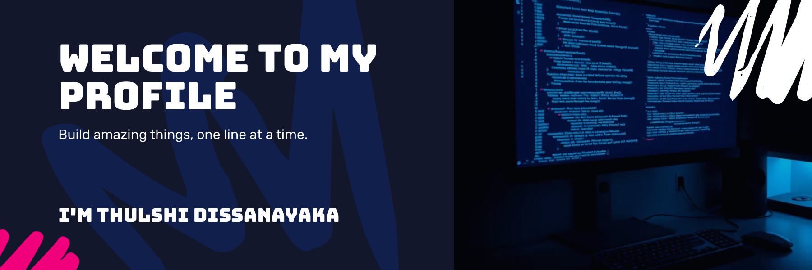

  

<!-- Badges Section -->

  <!-- Profile Views -->
  
  
  <!-- Public Repo Count -->
  
  
  <!-- Commits This Month -->
  

  I am an undergraduate at <b>Cardiff Metropolitan University</b>, specializing in <b>Frontend Development</b> with a strong passion for creating modern, responsive, and user-friendly web and mobile applications. I enjoy turning ideas into interactive digital experiences while continuously learning new technologies and best practices. With a focus on clean design and efficient code, I am eager to contribute to professional projects, collaborate with teams, and grow as a developer.

----

<h3 align="center">⚡ Tech Stack</h3>

  <!-- HTML -->
  &nbsp;&nbsp;&nbsp;

  <!-- CSS -->
  &nbsp;&nbsp;&nbsp;

  <!-- JavaScript -->
  &nbsp;&nbsp;&nbsp;

  <!-- PHP -->
  &nbsp;&nbsp;&nbsp;

  <!-- Java -->
  &nbsp;&nbsp;&nbsp;

  <!-- C++ -->
  &nbsp;&nbsp;&nbsp;

  <!-- C# -->
  &nbsp;&nbsp;&nbsp;

  <!-- .NET -->
  &nbsp;&nbsp;&nbsp;

  <!-- SQLite -->
  &nbsp;&nbsp;&nbsp;

  <!-- MySQL -->
  &nbsp;&nbsp;&nbsp;

  <!-- Bootstrap -->
  &nbsp;&nbsp;&nbsp;

  <!-- Git -->
  &nbsp;&nbsp;&nbsp;

  <!-- Figma -->
  &nbsp;&nbsp;&nbsp;

----
<h3 align="center">🚀 Currently Learning</h3>

  <!-- React -->
  &nbsp;&nbsp;&nbsp;

  <!-- Node.js -->
  &nbsp;&nbsp;&nbsp;

  <!-- Tailwind CSS -->
  &nbsp;&nbsp;&nbsp;

  <!-- Swift -->
  &nbsp;&nbsp;&nbsp;

  <!-- Flutter -->
  &nbsp;&nbsp;&nbsp;

  <!-- Dart -->
  &nbsp;&nbsp;&nbsp;

----

<h3 align="center">📊 GitHub Stats</h3>

  <!-- GitHub Stats -->
  
  
  <!-- Top Languages -->
  

  

    <!-- GitHub Streak -->
    
  

